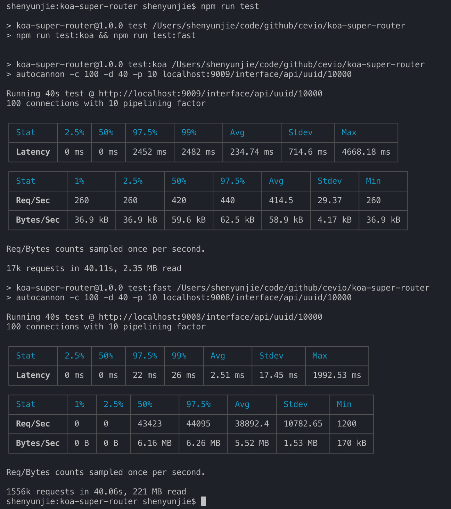

# koa-rapid-router

It is a routing architecture suitable for any service, and we usually use it on KOA. It is currently the fastest routing architecture.

## Install

```bash
npm i koa-rapid-router
```

## Usage in koa

```javascript
const Koa = require('koa');
const Router = require('koa-rapid-router');
const app = new Koa();
const route = new Router();
const router = route.create('/interface/api');
router.get('/uuid/{uid:number}', async (ctx) => {
  ctx.body = ctx.params.uid;
});
app.use(route.Koa()).listen(3000, err => {
  if (err) throw err;
  console.log('app run at 3000');
});
```

## Performance

Its performance is about 100 times that of [koa-router](https://www.npmjs.com/package/koa-router), but it's similar to [fastify](https://www.npmjs.com/package/fastify) (if you don't use the KOA infrastructure, use http). There are pictures and facts:



1. **test:koa** `koa + koa-router` Latency: 245.07 ms, Req/Sec: 394.25, Bytes/Sec: 56 kB
2. **test:fast** `fastify` Latency: 1.96 ms, Req/Sec: 49324, Bytes/Sec: 7 MB
3. **test:rapid** `koa + koa-rapid-router` Latency: 2.17 ms, Req/Sec: 44828.8, Bytes/Sec: 6.37 MB
4. **test:http** `http + koa-rapid-router` Latency: 1.64 ms, Req/Sec: 58911.2, Bytes/Sec: 5.95 MB

It is clear from the data that the performance advantages of the service can be established through `http + koa-rapid-router'. And `fastify', the fastest route, has been completely defeated by `fast-router'.

### How to test?

First open a new command line:

```bash
npm run dev
```

Then, open a new command line

```bash
npm run test
```

You can see a very shocking result.

## License

[MIT](http://opensource.org/licenses/MIT)

Copyright (c) 2018-present, yunjie (Evio) shen