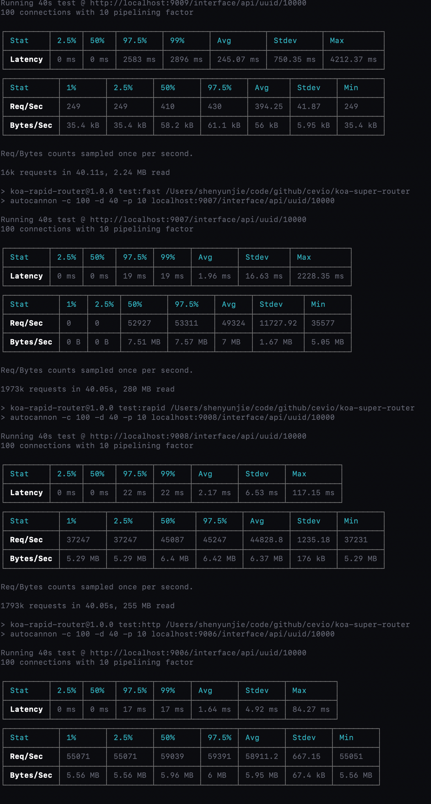

# koa-rapid-router

It is a routing architecture suitable for any service, and we usually use it on KOA. It is currently the fastest routing architecture.

## Install

```bash
npm i koa-rapid-router
```

## Usage in koa

```javascript
const Koa = require('koa');
const Router = require('koa-rapid-router');
const app = new Koa();
const route = new Router();
const router = route.create('/interface/api');
router.get('/uuid/{uid:number}', async (ctx) => {
  ctx.body = ctx.params.uid;
});
app.use(route.Koa()).listen(3000, err => {
  if (err) throw err;
  console.log('app run at 3000');
});
```

## Performance

Its performance is about 100 times that of [koa-router](https://www.npmjs.com/package/koa-router), but it's similar to [fastify](https://www.npmjs.com/package/fastify) (if you don't use the KOA infrastructure, use http). 

Test sample: 10,000 static routes are injected into different architectures.

The test commands are the same: `autocannon-c 100 -d 40 -p 10 <url>`

There are pictures and facts:



| command | architecture | Latency | Req/Sec | Bytes/Sec |
| :-----: | :----------: | :-----: | :-----: | :-------: |
| **test:koa** | `koa + koa-router` | 245.07 ms | **394.25** | 56 kB |
| **test:fast** | `fastify` | 1.96 ms | **49324** | 7 MB |
| **test:rapid** | `koa + koa-rapid-router` | 2.17 ms | **44828.8** | 6.37 MB |
| **test:http** | `http + koa-rapid-router` | 1.64 ms | **58911.2** | 5.95 MB |

It is clear from the data that the performance advantages of the service can be established through `http + koa-rapid-router`. And `fastify`, the fastest route, has been completely defeated by `fast-router`.


### How to test?

First open a new command line:

```bash
npm run dev
```

Then, open a new command line

```bash
npm run test
```

You can see a very shocking result.

## License

[MIT](http://opensource.org/licenses/MIT)

Copyright (c) 2018-present, yunjie (Evio) shen